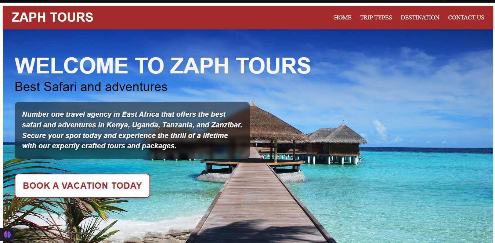

# Zaph Tours

**Tagline:** *Best Safaris and Adventures*

Zaph Tours is a premier travel company based in Kenya, specializing in safaris and adventure tours across Kenya and beyond. This project is a front-end website developed to enhance Zaph Tours' online presence and help attract more customers by showcasing travel packages, testimonials, and destination highlights in a visually engaging and user-friendly format.

---

## 🌍 Project Overview

This website reflects Zaph Tours' brand and values—adventure, professionalism, and Kenyan hospitality. It provides users with all the necessary information to plan their perfect safari or adventure tour.

---

## 🔗 Live Demo

*Coming soon...*

---

## 📁 Pages & Features

### 🏠 Home Page
- **Hero Section**: Eye-catching image or video with the tagline *"Best Safaris and Adventures"*.
- **About Section**: Brief description of Zaph Tours (dummy content).
- **Featured Destinations**: Showcases 6 top destinations with images, descriptions, and pricing:
  - Mt. Kenya
  - Mt. Ruwenzori
  - Lake Nakuru
  - Tsavo National Park
  - Nairobi National Park
  - Coastal Kenya
- **Testimonials**: Quotes and photos of satisfied customers.
- **Newsletter Signup**: Email form to subscribe for safari and adventure updates.

---

### 📌 Destinations Page
Each destination card includes:
- High-quality image
- Name of destination
- Short description
- Price per group
- Price per individual
- Link to a detailed (dummy) page

---

### 🎒 Trip Types Page
Showcases various trip packages with:
- Title
- Image gallery
- Detailed description
- Pricing and offers

**Available packages:**
- Honeymoon
- Family
- Adventure
- Cultural Tours
- Wildlife Safaris
- Eco-Tours
- Luxury Vacations
- Beach Holidays
- Wellness Retreats
- Culinary Tours

---

### 📝 Blog Page
*Coming soon…*

---

### 📞 Contact Us Page
Includes:
- Contact form (Name, Email, Subject, Message)
- Company contact details (email, phone, physical address)
- Interactive location map
- Office hours
- Social media links

---

## 🛠️ Technologies Used

- **React.js** (with Vite)
- **Material-UI (MUI)** for UI components
- **React Router** for page navigation
- **EmailJS** (or similar) for contact form handling
- **Framer Motion** *(optional)* for animations
- **Google Maps Embed** for map integration

---

## 🚀 Setup Instructions

1. **Clone the repository:**
   ```bash
   git clone https://github.com/your-username/zaph-tours.git
   cd zaph-tours
```
2. **Install dependencies:**

   ```bash
   npm install
   ```
3. **Start the development server:**

   ```bash
   npm run dev
   ```

4. **Build for production:**

   ```bash
   npm run build
   ```

---

## 📂 Folder Structure

```
src/
├── assets/               # Images and videos
├── components/           # Reusable components
├── pages/                # Page-specific components
│   ├── Home.jsx
│   ├── Destinations.jsx
│   ├── TripTypes.jsx
│   ├── Blog.jsx
│   └── Contact.jsx
├── App.jsx
└── main.jsx
```

---

## 📧 Contact

**Zaph Tours**

* 📧 Email: [info@zaphtours.com](mailto:info@zaphtours.com)
* 📞 Phone: +254 712 345 678
* 📍 Address: Zaph Towers, Nairobi, Kenya
* 🌐 Website: *Coming soon*

---

## 📢 Credits

Project designed and developed by [Carlos Madahana].
All media content (images/videos) used are for demo purposes only.

---


